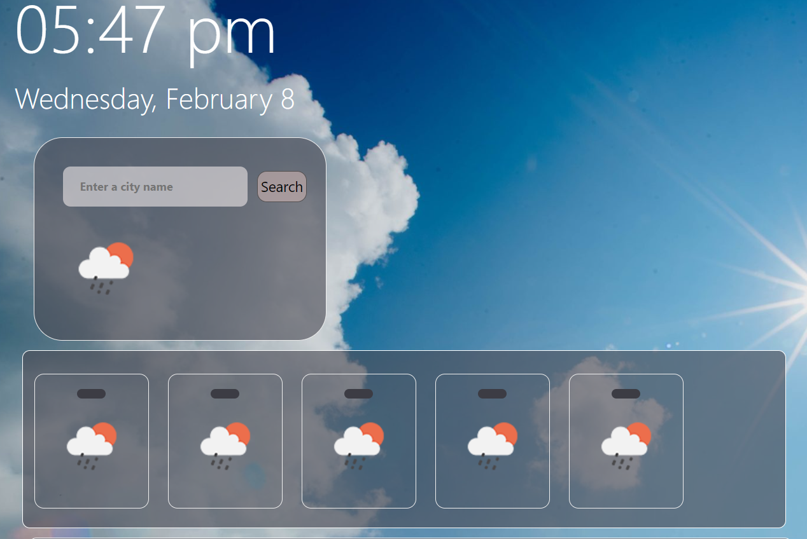

# weather-application

## The links for my Project
[github page](https://github.com/Maha-Abdelnabi/weather-application)

[deployed webpage](https://maha-abdelnabi.github.io/weather-application/)

# Descripton
this is a code weather application project as a bootcamp student.
this project used HTML, CSS, JavaScript and APIs to displays current and 5 days weather forecast based on user's city. 

## Usage

GIVEN a weather dashboard with form inputs

WHEN  search for a city
THEN  presented with current and future conditions for that city and that city is added to the search history.

WHEN  view current weather conditions for that city
THEN  presented with the city name, the date, an icon representation of weather conditions, the temperature, the humidity, and the wind speed

WHEN  view future weather conditions for that city
THEN  presented with a 5-day forecast that displays the date, an icon representation of weather conditions, the temperature, the wind speed, and the humidity

WHEN  click on a city in the search history
THEN  presented again with current and future conditions for that city

